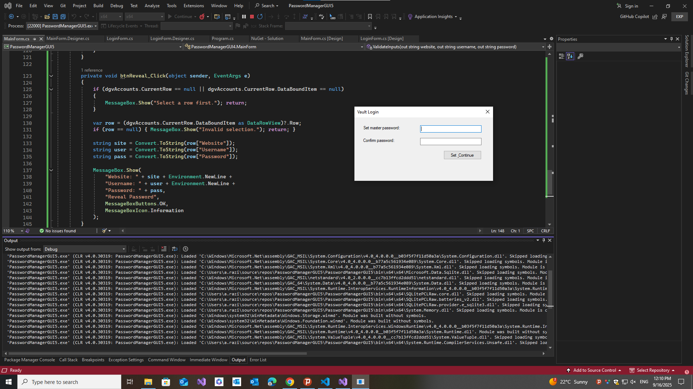
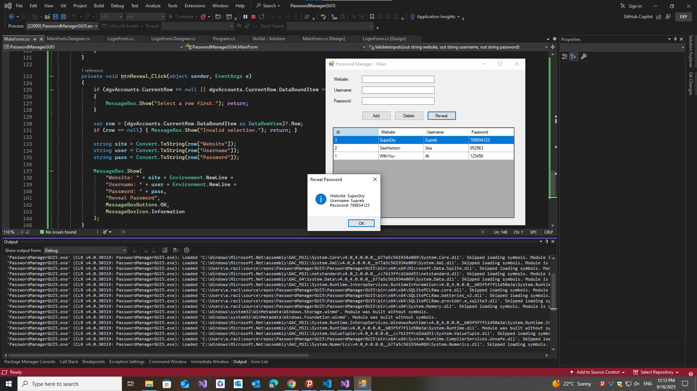

# 🔐 PasswordManagerGUI4

A **WinForms** password manager built for learning:
- **Login screen** with **master password** (PBKDF2 hash)
- **SQLite** local database (`passwords.db`)
- **CRUD UI** (Add/Delete) + **DataGridView** list
- **Reveal** selected password (demo)

> ⚠️ For learning only — passwords are stored as **plaintext** in DB in this version.

---

## 🚀 Getting Started

### Prereqs
- Visual Studio 2019/2022
- .NET Framework **4.7.2**
- NuGet:
  - `Microsoft.Data.Sqlite`
  - `SQLitePCLRaw.bundle_e_sqlite3`

### Run
1. Clone repo and open in Visual Studio.
2. Set Platform to **x64** (or **x86**) — avoid *Any CPU*.
3. **Build → Rebuild**, then **F5**.
4. First run: set a **master password**.  
5. Add accounts and manage them in the grid.

---

## 📚 Learning Goals

This project helped me strengthen my C# and WinForms skills by learning how to:

- ✅ Work with **partial classes** (`Form.cs` + `Form.Designer.cs`)  
- ✅ Build a **multi-form workflow** (Login → Main Window)  
- ✅ Use **SQLite** with `Microsoft.Data.Sqlite`  
- ✅ Perform **CRUD operations** in a local DB  
- ✅ Bind and display data in a **DataGridView**  
- ✅ Handle common **Visual Studio debugging issues** (namespace mismatches, duplicate event handlers, Any CPU issues)  
- ✅ Apply **secure password hashing** with PBKDF2 for the master password  

---

## 🖼 Screenshots

### 🔑 Login Form

### 📋 Main Window (Password Manager)

---

## 📂 Structure

PasswordManagerGUI4/.

├── Program.cs

├── LoginForm.cs

├── LoginForm.Designer.cs

├── MainForm.cs

├── MainForm.Designer.cs

├── passwords.db # created on first run

└── README.md
